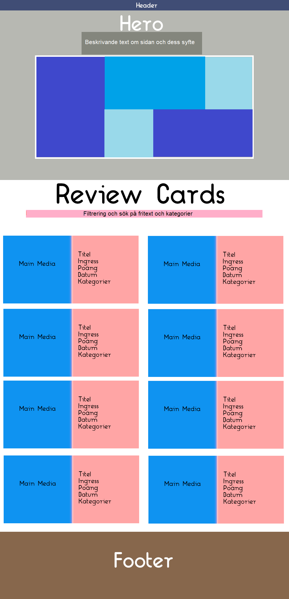
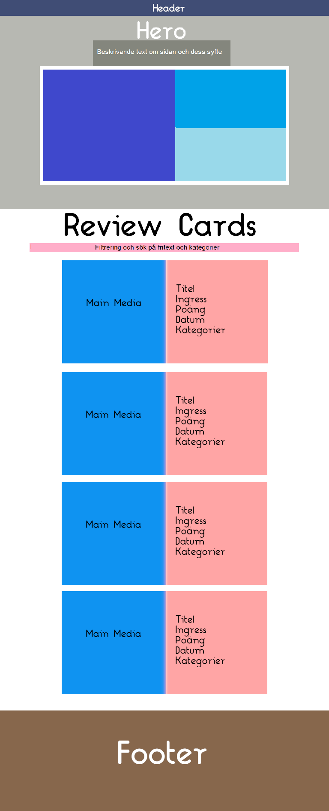
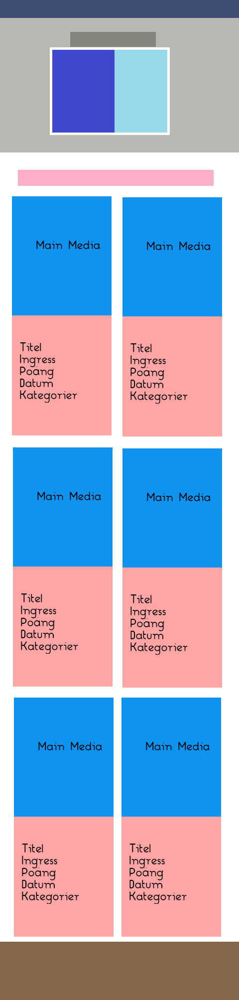
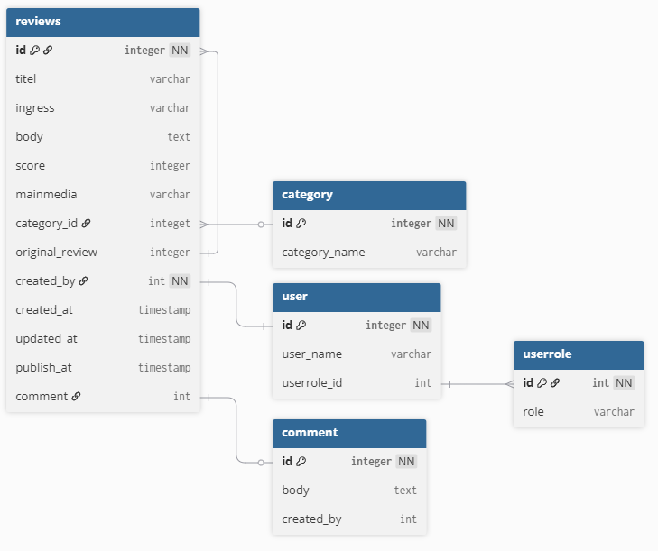

> [!NOTE]
> 🚧 **More to come, later** 🚧 <br>
> After two weeks this project has come to an end. Work will still be ongoing but closing thoughts can be found [here](#-retrospective). This readme will be a living object with more details coming as I continue to learn...

# 💼 Frontend development showcase/portfolio
As a student at Lexicon in a crash frontend dev course I set out to create a showcase/portfolio with my accumulated knowledge about HTML/CSS(Tailwind) Typescript/React/Nextjs.
With this repository a connected [project plan](https://github.com/users/fnelin/projects/5) is available for transparent workflow showcase.<br>
### ❔ About Lexicon Frontend development crash course
The Lexicon Frontend dev crash course is a hands-on program designed to prepare for modern Frontend development roles. The training spans the full development lifecycle, from foundational HTML and CSS to building advanced applications with TypeScript, Node.js, JavaScript and React. Advanced AI assistance will be clearly marked within the code if such has been utilized from either Codepen and/or Copilot.<br>
### 🔍 Key areas of focus:
While the course in itself focus on a wide variety of technologies for creating modern webb applications this project will include most, but not all, of below.
+ HTML & CSS: Semantic HTML, CSS modules, Tailwind, Flexbox, CSS Grid, responsive design, accessibility
+ Version Control & Agile Methods: Git, GitHub, SCRUM, agile workflows
+ TypeScript: ECMAScript standards, modular code structure, DOM manipulation, event handling, REST and GraphQL APIs
+ React: Next.js, SPA development, component architecture, state management, routing, forms, and commonly used React libraries
## 📖 Instructions and workflow
Instructions (in swedish) for the project can be found [here](https://github.com/Lexicon-Utbildning-Front-end-2025-2026/individuellt-arbete).<br>
Detailed workflow can be found in the [project plan](https://github.com/users/fnelin/projects/5) while an overview look like this:
- [x] 🎨 Create plan, wireframe and moc
- [x] 🛠️ Research requirements, define scope & select toolset
- [x] ✔️ Project greenlit by teachers/mentors
- [x] 📋 Userstories created and translated into backlog tasks
- [x] 🖼️ Install project and framework
- [x] 🏃 Sprint 1 - Backend & architecture
- [x] 🏃 Sprint 2 - Layout & UI components
- [x] 🏃 Sprint 3 - CRUD, accessibility & verification
- [x] 📜 Presentation, demo and feedback
- [x] 🍾 Project completed
- [x] ♻️ Retrospective
- [ ] 👷 Continued work and updates as knowledgebase grows

## 💭 Pitch & Moc
A site to collect all the various types of reviews that I keep writing on different sites. Mostly for my own sake for memory help about things I've encountered, seen, experienced etc.

### 🧭 Interface & Database design
Rough design templates representing thoughtprocess of the interface.<br>
Colors represent elements and not the actual colorschema.
<table>
  <tr>
    <td align="center" valign="top" width="270">
      <strong>Desktop</strong><br>
      
    </td>
    <td align="center" valign="top" width="198">
      <strong>Tablet</strong><br>
      
    </td>
    <td align="center" valign="top" width="125">
      <strong>Mobile</strong><br>
      
    </td>
  </tr>
  <tr>
    <td align="center" valign="top" colspan="3">
      <strong>Database design</strong><br>
      
    </td>
  </tr>
</table>

### 🧱 Requirements, scope and toolset:
+ <strong>Functional</strong>
  + Responsive design for desktop, tablet and mobile viewers
  + Semantic html and accessability.
  + Basic header and footer. ?Navigation
  + A mellow colorschema
  + Reviews are presented as cards on main page and links to details. ?Modals
  + Ability to save, edit, delete reviews and categories
  + Each review can be categorised with one or several labels
+ <strong>Technical</strong>
  + As much server side rendering as possible
  + Techstack consisting of HTML / Tailwind(CSS) / Typescript / NextJS / Storage
  + Storage ~~could be JSON file,~~ SQLite ~~or PostgreSQL~~ with ~~either~~ Prisma ~~or Drizzler~~ as ORM
  + Simple database design created at [dbdiagram.io](https://dbdiagram.io/d/portfolioFE-69a2a405a3f0aa31e1602d78)
+ <strong>AI usage </strong>
  + Chatgpt & Deepseek used for inspiration, database seed
  + Copilot used within code editor VSCode for faster repetitive work
  + Codepen mainly for adhoc unit testing and functional debugging
+ <strong>Limited scope</strong>
  + User profile handling will not be implemented
  + Limited search/filtering in base version.
  + Database designed for future additions, such as commenting and re-reviews.
  + All resources be local, no use of cloud service or third party cookies
## ⚡ Hackatons
Friday afternoons are for hackatons. A place and time where the team can freely work on or add features not specified in the sprint planning. Such features will have their commits labeled <strong>Hackaton</strong>. <br />
So far the hackatons has provided:
+ Skeleton loading forms
+ Basic searchfeature for archive
## 📂 Project Structure
### ⚙️ Architecture & backend
Folder structure of the project:
```
root/
├── (.)/                    #Local configuration and cache folders. Not synced.
│
├── app/
│   ├── (routes)/           # Routes for pages and slugs
│   ├── @modal/             # Route for modals
│   └── generated/prisma    # Generated prisma client information
│
├── components/             
│   ├── ui/                 # Reusable elements (Button, Input, Card)
│   └── feature/            # Feature-specific components (ReviewCard, etc.)
│
├── lib/                    # Shared application functions 
│   └── db/                 # Shared database functions 
│
├── prisma/                 # Prisma client information and schema
│
├── db/                     # Development database
│
├── public/                 # Resources for publication
│   └── images/             # Images for publication
├── planning/               # Project documentation & mocs
├── types/                  # Types & interfaces
└── node_modules/           # Generated by the system
```

Database model for prisma
```
model reviews {
  id              String   @id @default(cuid())
  titel           String
  ingress         String
  body            String
  score           Int
  mainmedia       String
  category        category @relation(fields: [category_id], references: [id])
  category_id     String
  original_review String
  published       Boolean? @default(false)
  updatedAt       DateTime @updatedAt
  createdAt       DateTime @default(now())
}

model category {
  id            String @id @default(cuid())
  category_name String
  reviews       reviews[]
  }
```

## 🔤 Typography
Three fonts are used, each for a distinct role:
| Role | Font | Usage |
|------|------|-------|
| Headings | [Bricolage Grotesque](https://fonts.google.com/specimen/Bricolage+Grotesque) | Titles, section headers, review names |
| Body | [Plus Jakarta Sans](https://fonts.google.com/specimen/Plus+Jakarta+Sans) | Review content, descriptions, paragraphs |
| Mono | [DM Mono](https://fonts.google.com/specimen/DM+Mono) | Scores, dates, tags, metadata |
## 🎨 Color Schema
Claude AI helped me pick out a warm editorial palette.<br />
I asked for an off-white base with deep ink and mellow accent. The inital color palette got manually adjusted in order to comply with WCAG AA contrast requirements. For darkmode the colors are basicly switched around.

| Swatch | Name | Hex | Usage |
|--------|------|-----|-------|
|  | `ink` | `#1a1410` | Primary text, headings |
|  | `ink-light` | `#3d322a` | Secondary text |
|  | `parch` | `#f5f0e8` | Page background |
|  | `parch-dark` | `#e8e0d0` | Card backgrounds, subtle dividers |
|  | `accent` | `#c7692a` | Scores, CTAs, links, highlights |
|  | `accent-light` | `#e8894a` | Hover states |
|  | `muted` | `#5c4d43` | Dates, tags, metadata |
## 🐛 Known bugs
+ ~~Full review cards don`t display mobile only formatting~~
+ Pagination show more pages than availible when searching.
  + This is due to how Prisma works. Need to add another query with same WHERE clause and without take/skip for total count of selection.
+ ~~Hydrationserror navbar & searchbox~~ (Multiline tailwind in client components consolidated to one-liners.)
+ Results after searching archive lost same width for all items.
## 📌 Wishlist
+ Client side form validation for create and edit forms.
+ Toasters to signify change of data
+ Easy file upload of pictures when creating or editing reviews.
+ GPS coordinates linked to small maps from google.
+ Custom 404page
+ Replace score with stars/boilerplate green
+ Full fledged admin mode
+ Search functions such as sort by columns (asc, desc) etc, view table/cards
# 📖 Retrospective
After two weeks of living with this project I`m pleased with how it came out and how I kept to the project plan, workflow and above objectives. AI in the form of claude.ai and copilot helped out with much of the mundane coding work, ie translate form input values to values ready for database insertion or keeping tailwind consistent over different components.<p>
The application is in a state of where it could be published as a functional beta ready for mass testing.
## 🌟 Three things that went well
1. Modal dialog forms. Once I got my head around the routing needed and solving client-server side relationship issues the end result became better than expected.
2. Hackatons! Relaxed way to test new tech and coming changes before committing to them.
3. Server side database integration. As this course focus on frontend I expected more work before I had a functional database environment running.
## 🔧 Three things that can be improved
1. Bugcatching. A few bugs made it through and delayed the development process.
2. Better at keeping feature branches "clean". One commit became very troublesome after the feature branch incorporated changes to several components at once.
3.  Installationprocess for developers. As the package is configured moving it between developing machines is overly complicated

# 🏅 About the author
Former MCSD SQLServer developer who ventured into economics, finance and marketing before coming back as modern frontend developer with fullstack insights. <br>
Other skills include but are not limited to analytical and business-oriented IT economist with experience in portfolio governance, budgeting, financial workflows and administration. Combines strong technical capabilities with a background in system development, databases, and BI. Skilled at driving structured ways of working, enabling informed decision making through clear analysis and acting as the link between IT and a broader organization.
## 📧 Contact
E-mail: fredrik.nelin(@)outlook.com<br>
LinkedIn: https://www.linkedin.com/in/fnelin/en<br>
Project link: https://github.com/fnelin/portfolioFE
## License
The source code in this repository is licensed under the MIT License.<br />
Images and other media assets are licensed separately under
CC BY-NC 4.0 and may not be used for commercial purposes.
See LICENSE-ASSETS for details.
